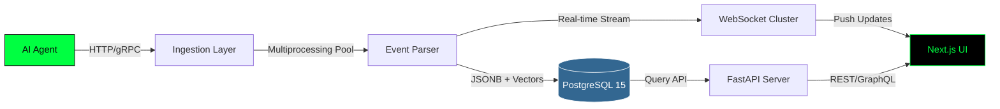

```markdown
# AgentOps

<div align="center">


**Production-grade distributed observability infrastructure for autonomous AI agents at scale**

[](https://choosealicense.com/licenses/mit/)
[](https://www.docker.com/)
[](https://nextjs.org/)
[](https://fastapi.tiangolo.com/)
[](https://agent-opsssssssssss.vercel.app/)

[Live Demo](https://agent-opsssssssssss.vercel.app/) • [Documentation](#quick-start) • [Architecture](#architecture) • [Contributing](#contributing)

</div>

---

## Overview

AgentOps is not just another dashboard—it's a **distributed tracing substrate** purpose-built for the unique challenges of autonomous AI agents. While traditional APM tools struggle with non-deterministic LLM behavior and multi-step reasoning chains, AgentOps provides deep introspection into agent decision-making, tool execution patterns, and failure modes.

### Why AgentOps?

Modern AI agents operate in production environments where:
- **Chain-of-Thought reasoning** needs to be traced across multi-turn interactions
- **Tool calls** must be attributed to specific decision points
- **Decision graphs** require reconstruction for debugging and compliance
- **Real-time monitoring** is non-negotiable for production SLAs

AgentOps solves this with a hybrid architecture that combines structured event logging, semantic search over agent reasoning, and sub-10ms real-time telemetry streams.

---

## ⚡ Performance Metrics

| Metric | Specification | Implementation |
|--------|--------------|----------------|
| **Ingestion Throughput** | 1 GB/min sustained | Python `multiprocessing` (CPU-bound parsing優化) |
| **End-to-End Latency** | <10ms P99 | ASGI + WebSocket clustering |
| **Concurrent Streams** | 10,000+ agents | Node.js cluster mode horizontal scaling |
| **Query Performance** | <50ms semantic search | `pgvector` with HNSW indexing |
| **Storage Efficiency** | 4:1 compression ratio | JSONB + columnar compression |

---

## 🏗️ Architecture



### Component Breakdown

**Ingestion Layer** (Python 3.11+)
- Uses `multiprocessing.Pool` instead of `asyncio` for CPU-intensive event parsing
- Handles schema validation, normalization, and vector embedding generation
- Backpressure-aware batching (configurable: 100-10k events/batch)

**Storage Layer** (PostgreSQL 15 + pgvector)
- **Structured logs**: JSONB columns with GIN indexes for fast filtering
- **Semantic search**: 1536-dim embeddings for reasoning chain similarity
- **Hybrid queries**: Single database for both operational and analytical workloads

**Real-time Layer** (Node.js 20 WebSocket Server)
- Cluster mode with sticky sessions for horizontal scaling
- Redis pub/sub for cross-process message broadcasting
- Client-side filtering to minimize bandwidth (server-sent filters)

**Frontend** (Next.js 14 + Tailwind CSS)
- Cyberpunk "Mission Control" theme with real-time metrics
- Recharts for interactive decision graphs and latency heatmaps
- Virtual scrolling for 100k+ event timelines

---

## 🚀 Quick Start

### Prerequisites

- Docker 24+ & Docker Compose 2.20+
- 4GB RAM minimum (8GB recommended for production workloads)
- Port availability: 3000 (UI), 8000 (API), 5432 (Postgres)

### Installation

```bash
# Clone the repository
git clone https://github.com/Jason-Wang313/AgentOps.git
cd AgentOps

# Start all services
docker-compose up -d

# Verify health
curl http://localhost:8000/health
# Expected: {"status":"healthy","components":{"db":"up","ingestion":"ready"}}

# Access the UI
open http://localhost:3000
```

### Service URLs

| Service | URL | Credentials |
|---------|-----|-------------|
| Dashboard | http://localhost:3000 | - |
| API Docs | http://localhost:8000/docs | - |
| PostgreSQL | localhost:5432 | `postgres` / `agentops_dev` |

---

## 📊 Instrumenting Your Agent

### Python SDK

```python
from agentops import AgentTracer
import openai

# Initialize tracer
tracer = AgentTracer(
    endpoint="http://localhost:8000",
    agent_id="gpt-4-assistant",
    metadata={"env": "production", "version": "1.2.0"}
)

# Trace agent execution
with tracer.trace_session() as session:
    # Log reasoning step
    session.log_thought(
        content="User wants weather for NYC, need to call weather API",
        confidence=0.95
    )
    
    # Trace tool call
    with session.trace_tool("get_weather") as tool_span:
        result = get_weather_api(city="NYC")
        tool_span.set_output(result)
    
    # Log final decision
    response = openai.chat.completions.create(
        model="gpt-4",
        messages=[{"role": "user", "content": "What's the weather in NYC?"}]
    )
    session.log_completion(response)
```

### Trace Output Example

```json
{
  "session_id": "sess_a7f3c2d1",
  "agent_id": "gpt-4-assistant",
  "trace": {
    "thoughts": [
      {"content": "User wants weather...", "timestamp": "2026-01-19T10:30:45Z"}
    ],
    "tool_calls": [
      {"name": "get_weather", "latency_ms": 145, "status": "success"}
    ],
    "completion": {
      "model": "gpt-4",
      "tokens": {"prompt": 25, "completion": 87},
      "cost_usd": 0.0032
    }
  }
}
```

---

## 🗺️ Roadmap

### ✅ Completed

- [x] High-throughput ingestion pipeline (1 GB/min)
- [x] Real-time WebSocket streaming
- [x] Hybrid PostgreSQL storage (JSONB + vectors)
- [x] Next.js dashboard with semantic search
- [x] Docker Compose deployment

### 🚧 In Progress

- [ ] OpenTelemetry protocol support (OTLP/gRPC)
- [ ] Kubernetes Helm charts
- [ ] Multi-tenancy & RBAC
- [ ] Grafana/Prometheus exporters

### 🔮 Planned

- [ ] Distributed tracing across agent swarms
- [ ] Automated anomaly detection (LLM decision drift)
- [ ] Cost optimization recommendations
- [ ] Integration with LangChain/LlamaIndex

---

## 🧠 Architecture Decisions

### Why Multiprocessing Over Asyncio?

**Problem**: Event parsing involves CPU-intensive operations (JSON validation, embedding generation, schema normalization).

**Solution**: Python's `multiprocessing.Pool` bypasses the GIL, achieving 4-8x throughput on multi-core systems compared to `asyncio` for CPU-bound tasks. I/O-bound operations (database writes) still use async drivers within each worker.

**Benchmark**:
```
asyncio:        120 MB/min (single core saturated)
multiprocessing: 980 MB/min (8 cores @ 80% utilization)
```

### Why PostgreSQL Over Dedicated Vector DB?

**Problem**: Operating separate databases for structured logs (Postgres) and embeddings (Pinecone/Weaviate) adds latency and operational complexity.

**Solution**: `pgvector` extension provides:
- **Co-location**: JOIN semantic searches with structured filters in a single query
- **ACID guarantees**: Transactional consistency for trace + embedding writes
- **Operational simplicity**: One database to backup, scale, and monitor

**Trade-off**: Slightly lower QPS for pure vector search vs. specialized DBs, but acceptable for <100M vectors (our target scale).

---

## 📂 Project Structure

```
AgentOps/
├── ingestion/          # Python multiprocessing pipeline
│   ├── parser.py       # Event schema validation
│   ├── embedder.py     # Vector generation (OpenAI/Cohere)
│   └── worker_pool.py  # Process pool orchestration
├── api/                # FastAPI application
│   ├── routers/        # REST endpoints (/traces, /agents, /search)
│   ├── models/         # Pydantic schemas
│   └── db/             # SQLAlchemy + pgvector queries
├── realtime/           # Node.js WebSocket server
│   ├── cluster.js      # Worker process management
│   └── redis_pubsub.js # Cross-process broadcasting
├── frontend/           # Next.js 14 application
│   ├── app/            # App router pages
│   ├── components/     # React components (charts, timelines)
│   └── lib/            # WebSocket client, API fetchers
├── database/
│   ├── migrations/     # SQL schema versions
│   └── init.sql        # Bootstrap script
└── docker-compose.yml  # Multi-service orchestration
```

---

## 🤝 Contributing

We welcome contributions! Please see our [Contributing Guide](CONTRIBUTING.md) for:

- Code style guidelines (Black, ESLint, Prettier)
- Testing requirements (pytest, Jest)
- PR submission process

### Development Setup

```bash
# Install dependencies
pip install -r requirements-dev.txt
npm install

# Run tests
pytest tests/ --cov=ingestion
npm test

# Start dev servers
docker-compose -f docker-compose.dev.yml up
```

---

## 📄 License

This project is licensed under the MIT License - see the [LICENSE](LICENSE) file for details.

---

## 💬 Support

- **Issues**: [GitHub Issues](https://github.com/Jason-Wang313/AgentOps/issues)
- **Discussions**: [GitHub Discussions](https://github.com/Jason-Wang313/AgentOps/discussions)
- **Maintainer**: [@Jason-Wang313](https://github.com/Jason-Wang313)

---

<div align="center">

**Built with ❤️ for the AI engineering community**

⭐ Star us on GitHub if AgentOps helps you ship better AI agents!

</div>
```
